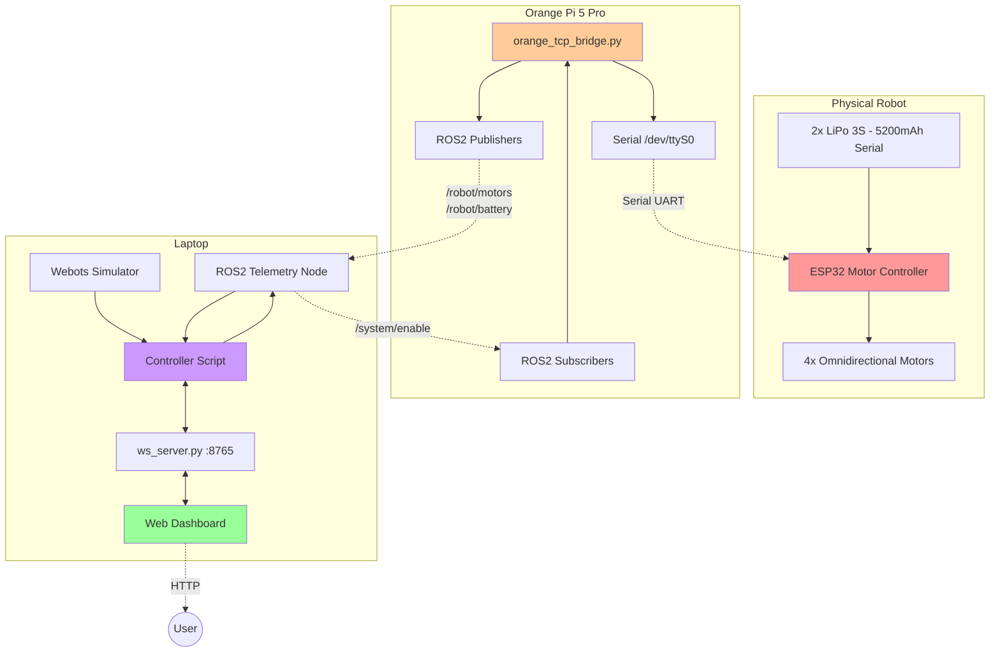
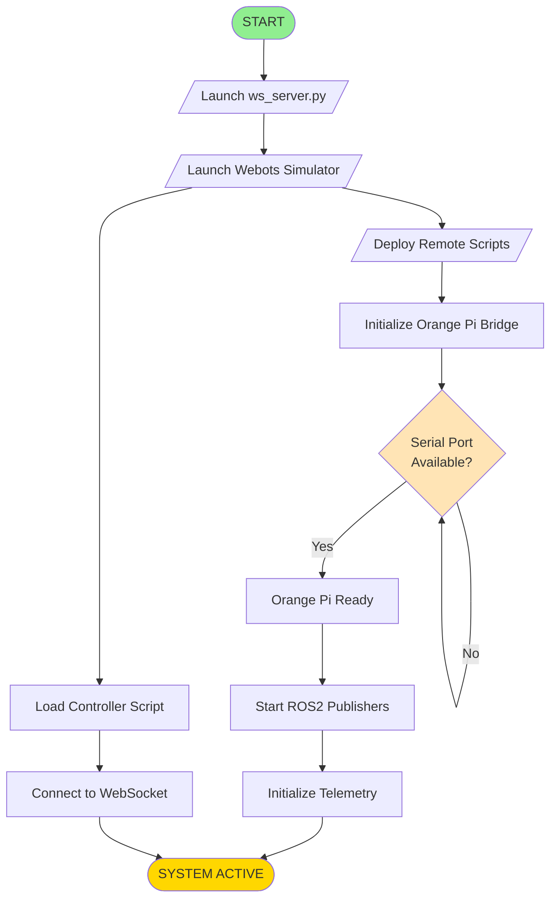
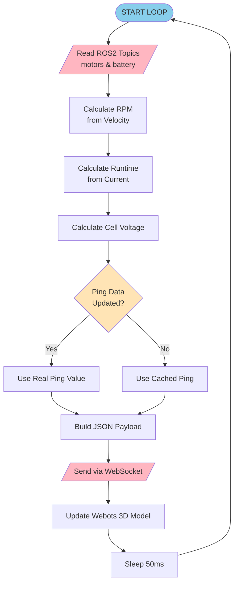
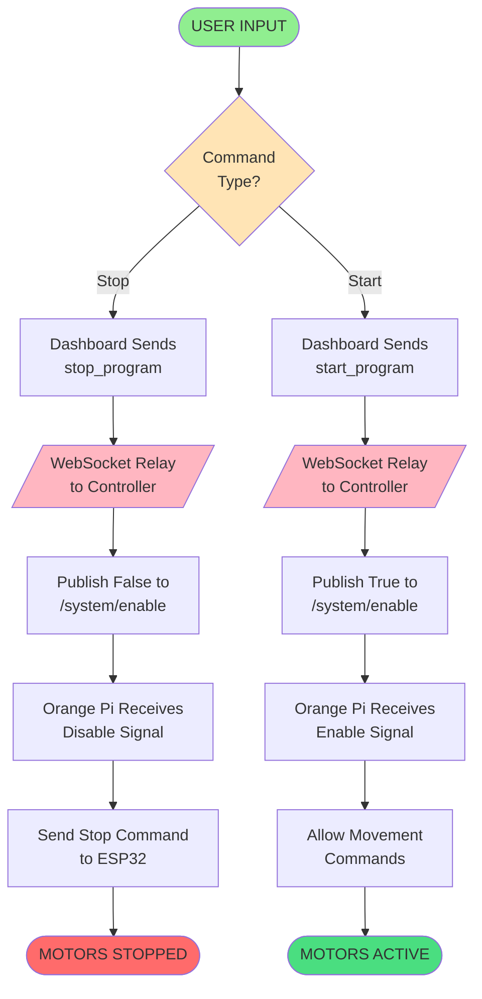
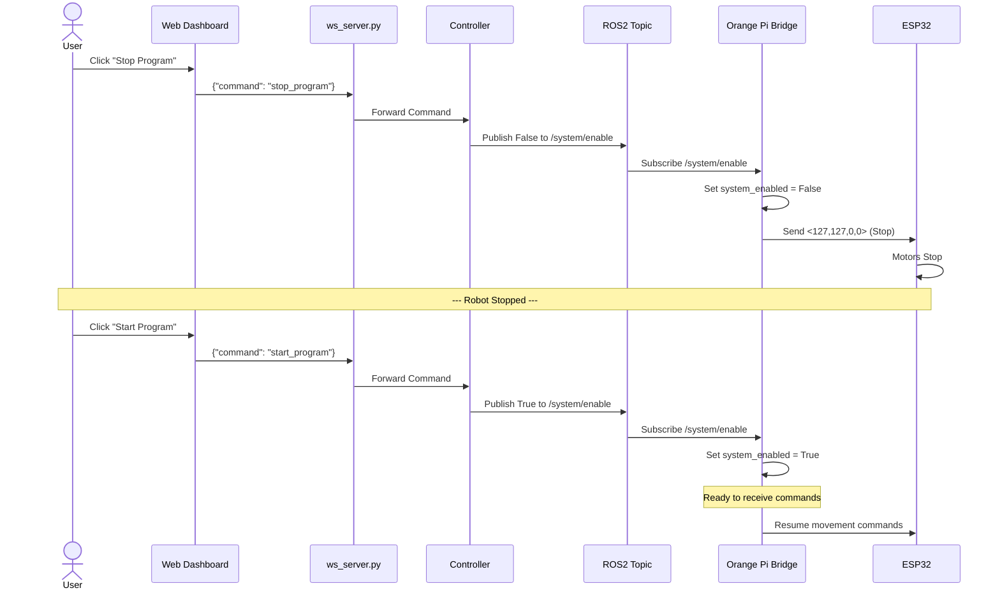

# Mermaid Chart Codes - Digital Twin Robot Omnidirectional

## 1. Diagram Arsitektur Sistem (Functional Diagram)

---

## 2. Flowchart Startup Sequence (IEEE Standard Format)

**Legend (IEEE Standard):**
- `([text])` = Terminal (Start/End)
- `[text]` = Process
- `{text}` = Decision
- `[/text/]` = Input/Output

---

## 3. Flowchart Main Telemetry Loop (IEEE Standard Format)

---

## 4. Flowchart Start/Stop Command (IEEE Standard Format)

---

## 5. Sequence Diagram - Communication Flow

---

## IEEE Flowchart Standard - Symbol Guide

### Simbol Standar yang Digunakan:

| Symbol | Mermaid Syntax | Kegunaan | Contoh |
|:---:|:---|:---|:---|
|  | `([text])` | Terminal (Start/End) | `([START])` |
|  | `[text]` | Process/Operation | `[Calculate Data]` |
|  | `{text}` | Decision | `{Ready?}` |
|  | `[/text/]` | Input/Output | `[/Read Data/]` |
|  | `[[text]]` | Predefined Process | `[[Init System]]` |

### Aturan Tambahan:
- Aliran dari **atas ke bawah** atau **kiri ke kanan**
- Label decision harus jelas: `Yes/No`, `True/False`, `1/0`
- Setiap proses memiliki 1 input, 1+ output
- Decision memiliki 1 input, 2+ output
- Gunakan warna konsisten untuk kategori yang sama

---

## Cara Pakai

1. **Copy** kode Mermaid di atas
2. **Paste** ke:
   - [Mermaid Live Editor](https://mermaid.live)
   - Markdown viewer yang support Mermaid (GitHub, GitLab, Notion, Obsidian)
   - VSCode dengan extension "Markdown Preview Mermaid Support"
3. Diagram akan ter-render otomatis

## Tips Editing
- Ubah warna: `style NODE_NAME fill:#HEXCOLOR`
- Ubah shape: 
  - `([])` = terminal (oval)
  - `[]` = process (rectangle)
  - `{}` = decision (diamond)
  - `[//]` atau `[\\]` = I/O (parallelogram)
  - `[[]]` = predefined process
- Ubah arrow: 
  - `-->` = solid line
  - `-.->` = dotted line
  - `==>` = thick line

---

**Format:** IEEE Standard Flowchart Symbols  
**Kompatibel dengan:** Mermaid.js, Graphviz, Draw.io
