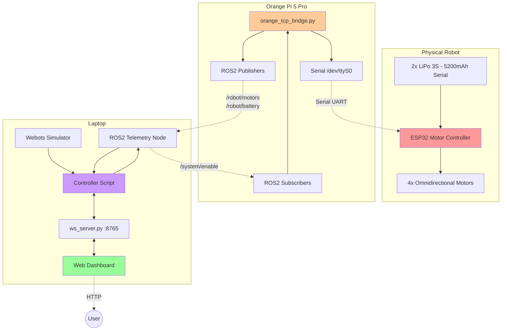
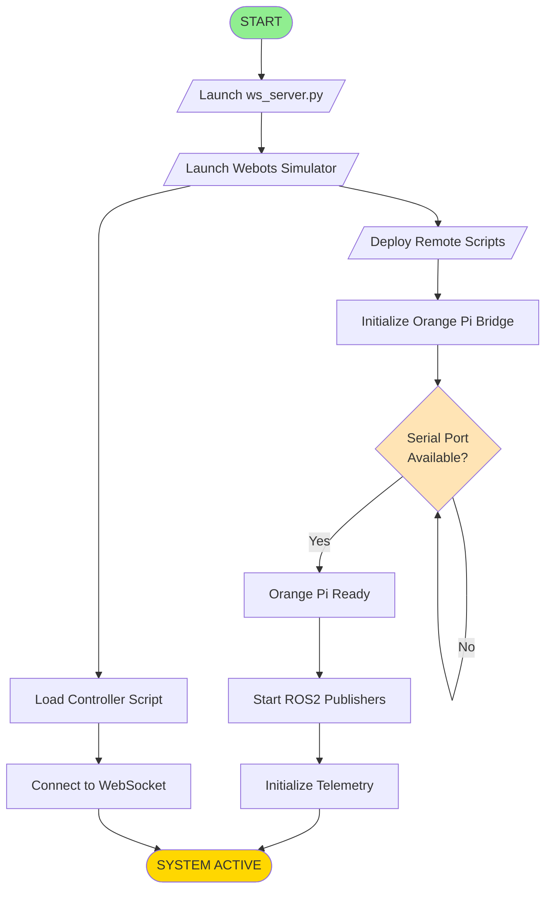
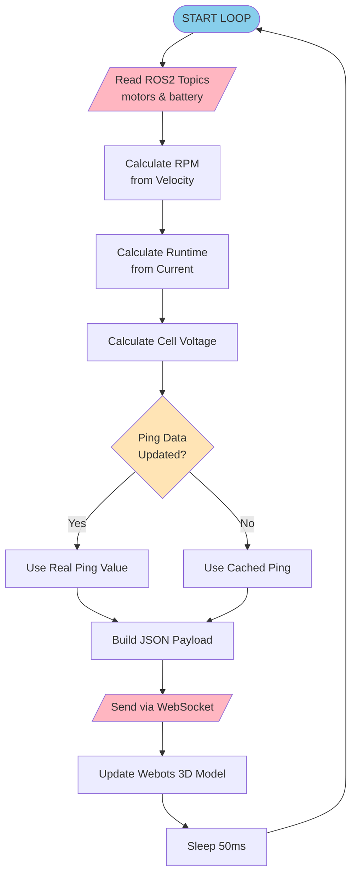
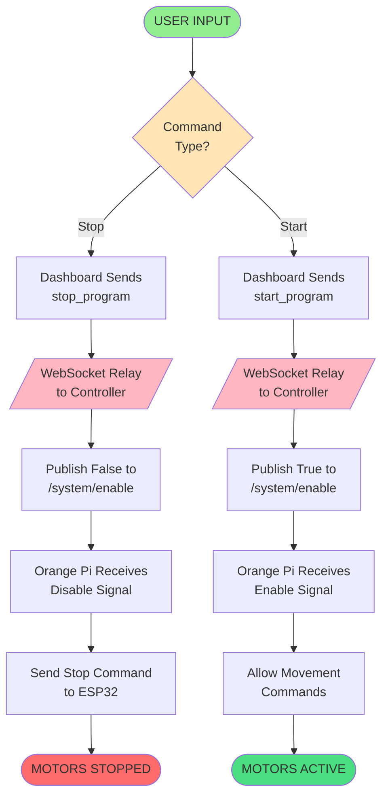

# Dokumentasi Sistem Digital Twin Robot Omnidirectional

## 1. Latar Belakang (Background)

### 1.1 Deskripsi Sistem
Digital Twin untuk Robot Omnidirectional adalah sistem monitoring dan kontrol robot bergerak berbasis Webots yang terintegrasi dengan hardware fisik. Sistem ini memungkinkan visualisasi real-time, pengontrolan jarak jauh, dan monitoring telemetri robot melalui antarmuka web modern.

### 1.2 Tujuan
- **Monitoring Real-time**: Menampilkan status robot (baterai, kecepatan, torsi, posisi) secara live
- **Kontrol Jarak Jauh**: Mengoperasikan robot via Dashboard Web (Start/Stop Program)
- **Sinkronisasi Digital Twin**: Simulasi Webots mencerminkan pergerakan robot fisik secara akurat
- **Telemetri Komprehensif**: Data baterai, motor, dan sistem real-time

### 1.3 Komponen Hardware
- **Orange Pi 5 Pro**: Bridge untuk komunikasi serial ke ESP32 dan ROS2
- **ESP32**: Motor controller untuk 4 roda omnidirectional
- **Laptop**: Menjalankan Webots simulator dan Web Dashboard
- **Baterai**: 2x LiPo 3S (5200mAh) dihubungkan serial

---

## 2. Metode (Technical Methods)

### 2.1 Arsitektur Komunikasi
Sistem menggunakan arsitektur terdistribusi dengan protokol berikut:
- **ROS2 (Humble/Jazzy)**: Publish/Subscribe untuk telemetri dan command
- **Serial UART**: Orange Pi → ESP32 untuk motor control
- **WebSocket**: Webots Controller ↔ Web Dashboard untuk visualisasi

### 2.2 Protokol Data

#### Serial Protocol (Orange Pi → ESP32)
```
Format: <x_val,y_val,b6,b7>\n
- x_val, y_val: PWM 0-255 (127 = stop)
- b6, b7: Rotation buttons (0/1)
```

#### WebSocket Protocol (Webots ↔ Web)
```json
{
  "timestamp": "ISO8601",
  "battery": { "soc": 95.5, "runtime_hours": 2.3 },
  "motors": { "torques": {...}, "rpm": {...} },
  "motion": { "vx": 0.5, "vy": 0.2, "w": 0.0 },
  "system": { "uptime": 123.4, "ping_ms": 15 }
}
```

### 2.3 Algoritma Kontrol

#### Speed Control
- **Multiplier**: 63 (Half Speed)
- **Formula**: `Vx = y_command * 63`, `Vy = x_command * 63`
- **Deadzone**: ±5 untuk menghindari motor jitter

#### Battery Estimation
- **Capacity**: 5200mAh (5.2Ah)
- **Runtime**: `hours = capacity / current`
- **Freeze Logic**: Saat current < 0.5A, tampilkan runtime terakhir (tidak reset ke 99h)

---

## 3. Diagram Fungsional (Functional Diagram)



---

## 4. Diagram Alir (Flowchart - IEEE Standard)

### 4.1 Startup Sequence (IEEE Format)



### 4.2 Main Telemetry Loop (IEEE Format)



### 4.3 Start/Stop Command Flow (IEEE Format)



---

## 5. Cara Penggunaan (Usage Instructions)

### 5.1 Persiapan Awal

#### Perangkat yang Dibutuhkan
1. ✅ Laptop dengan Webots R2025a terinstall
2. ✅ Orange Pi 5 Pro terhubung WiFi (IP: `10.30.117.200`)
3. ✅ Robot fisik dengan baterai terisi penuh (2x 3S LiPo)

#### Software Dependencies
```bash
# Laptop
sudo apt install python3-rclpy python3-websockets

# Orange Pi
pip3 install pyserial rclpy
```

---

### 5.2 Menjalankan Sistem

#### Step 1: Start WebSocket Server
```bash
cd ~/Documents/Digital_Twin_Interface
nohup python3 ws_server.py > ws_server.log 2>&1 &
```

#### Step 2: Start Web Dashboard
```bash
cd ~/Documents/Digital_Twin_Interface
npm run dev
# Buka browser: http://localhost:5173
```

#### Step 3: Start Webots & Controller
```bash
cd ~
./start_webots.sh
# Webots akan membuka world file robot
```

#### Step 4: Deploy Orange Pi Script
```bash
python3 ~/start_all_remote.py
# Script akan SSH ke Orange Pi dan deploy bridge
```

#### Step 5: Verifikasi Koneksi
Di Web Dashboard, cek indikator berikut:
- 🟢 **Connected** (hijau) = WebSocket aktif
- 🟢 **Ping < 50ms** (hijau) = Latensi bagus
- ⚡ **Battery Percentage** bergerak = Telemetri diterima
- 📊 **Torque Bars** naik-turun = Motor data aktif

---

### 5.3 Mengoperasikan Robot

#### Menggunakan Start/Stop
- **Stop Program**: Robot berhenti total (motor off), telemetri tetap update
- **Start Program**: Robot melanjutkan operasi

#### Monitoring Status
- **Battery Runtime**: Estimasi waktu sisa berdasarkan konsumsi saat ini
- **RPM**: Kecepatan rotasi rata-rata roda (0-400 RPM normal)
- **Torque**: Beban motor (0-5 Nm, hijau = rendah, merah = tinggi)
- **Motion (Vx, Vy, W)**: Kecepatan linear X/Y dan rotasi

---

### 5.4 Parameter Tuning

#### Mengubah Kecepatan Robot
Edit `~/Downloads/orange_tcp_bridge.py`:
```python
# Line ~160
Vx = y * 63   # Ubah 63 -> nilai lain
              # 127 = Full Speed
              # 63 = Half Speed (Current)
              # 32 = Quarter Speed
```

#### Mengubah Kecepatan Webots
Edit controller file:
```python
# Line ~186
MAX_LINEAR_VEL = 0.25  # Ubah nilai (m/s)
                       # 0.5 = Fast
                       # 0.25 = Medium (Current)
                       # 0.1 = Slow
```

---

### 5.5 Troubleshooting

#### Dashboard "Disconnected"
```bash
# Restart WebSocket Server
pkill -f ws_server.py
nohup python3 ~/Documents/Digital_Twin_Interface/ws_server.py > ws_server.log 2>&1 &

# Restart Webots
pkill -f webots
./start_webots.sh
```

#### Robot Tidak Bergerak
```bash
# Cek log Orange Pi
ssh orange@10.30.117.200
tail -f ~/orange_bridge.log
# Cari error "Serial" atau "Parse error"
```

#### Ping Tinggi (>100ms)
- Periksa kekuatan sinyal WiFi
- Pindahkan router lebih dekat
- Gunakan WiFi 5GHz jika tersedia

---

## 6. Spesifikasi Teknis

### 6.1 Performance Metrics
- **Control Loop**: 20Hz (Webots + Controller)
- **Telemetry Update**: 5Hz (Orange Pi publish)
- **WebSocket Latency**: <10ms (localhost)
- **Network Latency**: 5-45ms (WiFi typical)

### 6.2 Current Configuration
| Parameter | Value | Description |
|:---|:---|:---|
| Speed Multiplier | 63 | Half of max speed (127) |
| Webots Max Velocity | 0.25 m/s | Visual simulation speed |
| Battery Capacity | 5200 mAh | 2x LiPo 3S in series |
| Ping Update Rate | 1 Hz | Real ICMP ping every 1 second |

---

## 7. Referensi Kode Utama

### File Locations
```
/home/codename-hydra/
├── Downloads/
│   ├── orange_tcp_bridge.py        # Orange Pi bridge
│   └── start_all_remote.py         # Deployment script
├── Documents/
│   ├── Digital_Twin_Interface/
│   │   ├── ws_server.py            # WebSocket relay
│   │   ├── main.ts                 # Dashboard logic
│   │   └── index.html              # Dashboard UI
│   └── BroneRoda/controllers/
│       └── Diter_Roda_Tahap6_YOLO_WS_Bridge/
│           ├── Diter_Roda_Tahap6_YOLO_WS_Bridge.py  # Main controller
│           └── Diter_Roda_Tahap6_YOLO.py            # Base class
└── start_webots.sh                  # Webots launcher
```

---

**Dokumentasi dibuat:** 2026-01-05  
**Versi Sistem:** Digital Twin + WebSocket Bridge  
**Status:** ✅ Production Ready
